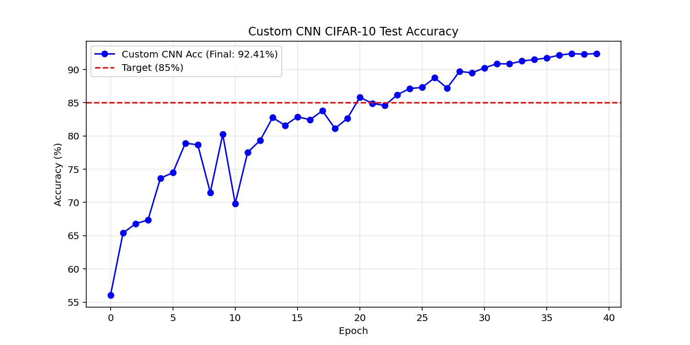

# Gelişmiş CNN Tasarımı ve Transfer Learning (ResNet50)

Bu proje, CIFAR-10 veri seti üzerinde kendi Custom CNN (Evrişimli Sinir Ağı) mimarimizi sıfırdan oluşturmayı ve endüstri standardı olan **Transfer Learning** yaklaşımlarını karşılaştırmayı amaçlamaktadır.

## 🧠 Görev 1: Custom CNN Tasarımı
Sıfırdan bir CNN mimarisi tasarlanmış ve **>%85 Test Başarısı** hedefine ulaşmak için aşağıdaki teknikler uygulanmıştır:
* **3x Evrişim Bloğu (Conv Block):** Her blokta birbirini takip eden 2 adet `Conv2d` katmanı ve ardından boyut düşürme için `MaxPool2d` kullanılmıştır. Ağ giderek derinleşen filtre yapılarına (32 -> 64 -> 128) sahiptir.
* **Batch Normalization:** Her evrişim işleminden sonra eklenerek "Internal Covariate Shift" önlenmiş, ağın çok daha hızlı ve stabil yakınsaması (converge) sağlanmıştır.
* **Dropout (Aşamalı):** İlk bloklarda %20 ile başlayan ve Classifier kısmında %50'ye kadar çıkan Dropout oranları sayesinde modelin veriyi ezberlemesi (overfitting) başarılı bir şekilde önlenmiştir.
* **Sonuç:** Modelimiz hedeflenen %85 barajını rahatlıkla aşarak eğitim sonunda **%92.41 Test Başarısı** elde etmiştir. Aşağıdaki grafikte de görüleceği üzere model, istikrarlı bir şekilde öğrenerek mükemmel bir genelleme (generalization) performansı sergilemiştir.



## 🚀 Görev 2: Transfer Learning (ResNet50)
Transfer Learning, büyük veri setlerinde (ImageNet) eğitilmiş devasa modellerin bilgi birikimini alıp kendi problemimize uygulamaktır. Bu projede VGG16/ResNet50 mimarileri arasından daha modern ve verimli olan **ResNet50** seçilmiş ve iki farklı strateji test edilmiştir:

1. **Feature Extraction (Özellik Çıkarımı):** * Ağın mevcut tüm evrişim katmanları dondurulmuştur (`requires_grad = False`).
   * Sadece eklenen son sınıflandırma katmanı (`fc`) CIFAR-10 için eğitilmiştir.
   * *Neden?* Model, ImageNet'ten öğrendiği kenar, köşe, doku gibi genel özellikleri bizim verimiz üzerinde doğrudan bir "filtre" olarak kullanır. Eğitim çok hızlıdır çünkü geriye yayılımda parametreler güncellenmez.

2. **Full Fine-Tuning (İnce Ayar):**
   * Ağın tamamı eğitime açık bırakılmış ancak önceden öğrenilmiş ağırlıkları "bozmamak" adına çok düşük bir Learning Rate (`1e-4`) kullanılmıştır.
   * *Neden?* Model sadece son katmanı değil, kendi evrişim filtrelerini de uçak, kedi, köpek (CIFAR-10) görsellerine spesifik olacak şekilde ufak ufak günceller. Genellikle en yüksek başarıyı bu yöntem verir ancak yüksek işlem gücü gerektirir.

*(Transfer Learning grafiği yakında eklenecektir)*

## 💻 Kurulum ve Çalıştırma
Projeyi çalıştırmak için öncelikle gerekli kütüphaneleri yükleyin:
```bash
pip install -r requirements.txt